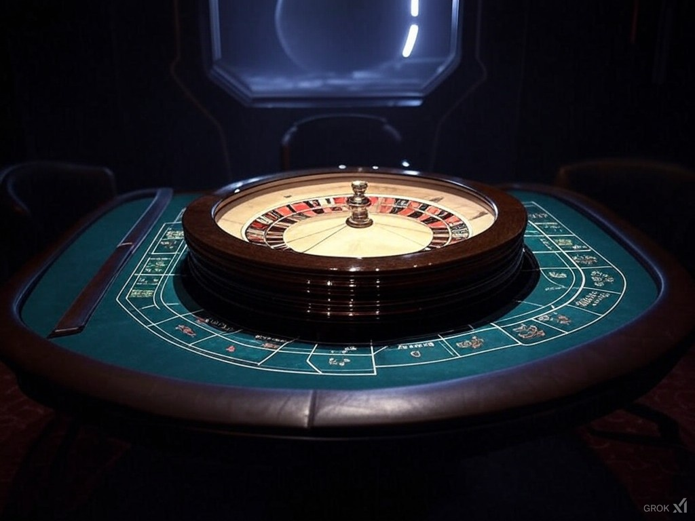

# Sci-Fi Roulette

Sci-Fi Roulette is a virtual roulette game developed using Photon and Electron. The primary goal of this project is to create a simple and user-friendly application that can be exported both as a standalone executable (.exe) and as an installer setup.

## About the Game

The game is heavily inspired by a sci-fi aesthetic similar to Star Wars. As a virtual roulette, its overall style resembles that of a Star Wars-themed casino. The visuals, sounds, and music throughout the game are designed to reflect the Star Wars universe.

⚠ **Note:** The game is available **only in Spanish**.

## Game Rules

### Betting Options

- **Even (Pares):** Bet that the winning number will be even. Probability of winning: 50%. Reward: 2x your bet.
- **Odd (Impares):** Bet that the winning number will be odd. Probability of winning: 50%. Reward: 2x your bet.
- **Sith (Red):** Bet that the winning number will belong to the Sith numbers. Probability depends on assigned numbers. Reward is adjusted accordingly.
- **Jedi (Black):** Bet that the winning number will belong to the Jedi numbers. Probability depends on assigned numbers. Reward is adjusted accordingly.
- **Single Number:** Bet on a specific number. Probability of winning: 1 in 36. Reward: 36x your bet.
- **Zero (Cero):** The riskiest bet with the highest reward. If the winning number is 0, you receive 50x your bet.

### Gameplay

1. **Place Your Bets:** Before spinning the roulette, you can bet your chips on one or more available options.
2. **Spin the Roulette:** The wheel will spin and determine the winning number.
3. **Winning Calculation:**
   - If your bet is correct, you receive a reward based on the probability of success.
   - **Example:** You bet 10 chips on a single number and win: You receive 360 chips.
   - **Example:** You bet 10 chips on 0 and win: You receive 500 chips.
   - If you lose, you forfeit the bet chips.
4. **Anti-Abuse Mechanism:** The intergalactic roulette is designed to prevent exploits. If you attempt to abuse the system or manipulate bets, all bonus rewards will be lost, and you will only receive back non-lost tokens.

### Special Bonuses

- If you win with **number 0**, you receive a **50x** reward! This is the highest payout in the game, reserved for the boldest players.

---

For any questions or feedback, feel free to contribute to the project!

🚀 May the odds be in your favor!
